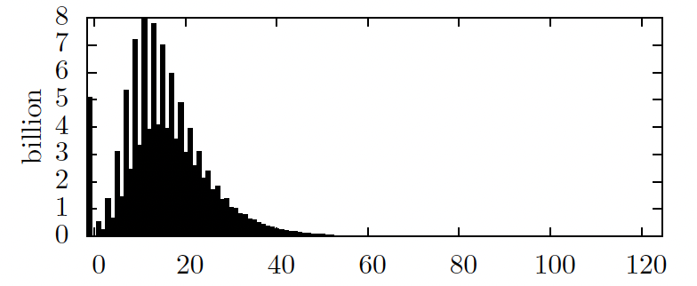

计算九子棋、Morabaraba 和 Lasker Morris 的超强及扩展解
---

Gábor E. Gévay 和 Gábor Danner

摘要——**九子棋及其变种 Lasker Morris 的强解是众所周知的结果（起始位置为和局）。我们重新审视了这两种游戏，并为它们计算了扩展强解。这里所说的扩展强解是指从某些起始位置出发、玩家要放置的棋子数量与标准规则不同的所有可能游戏状态的博弈论值。这些解答同样适用于此前未解决的第三种变体 Morabaraba，并取得了有趣的结果：大多数玩家可以放置相同数量棋子的起始位置（包括标准起始位置）对先手玩家是胜利（与上述游戏不同，这些位置通常是和局）。我们还开发了一种多值逆向分析方法，并将其作为算法的基础，用以超强解这些游戏。这意味着当我们的程序与一个可能出错的对手对弈时，相比于随机选择“仅强”最优走法，它更有可能达到比博弈论值更好的结果。之前对超强解的尝试采用了局部启发式方法或在游戏中学习，但我们将算法整合到了逆向分析中。**

# I. 引言

九子棋及其变种是两人对弈的、顺序进行的、完全信息的、确定性的、有限的零和游戏，具有三种可能的结果：胜、和、负（这些结果是从特定玩家的视角给出的）。

## I-A. 游戏求解

游戏求解可以在多个层次上进行 [1]：

- **超弱解**：通过可能是非构造性的证明获得起始位置的博弈论值，但未提供实现该值的实际策略。
- **弱解**：已知起始位置的博弈论值，并且拥有实现该值的策略。（这可能需要一个包含大量游戏状态博弈论值的数据库。）例如，跳棋在此意义上已经被求解 [2]。
- **强解**：已知一种策略，可以从任何可从起始位置到达的游戏状态实现博弈论值。这意味着即使一方或双方犯了错误，也能完美对弈。
- **超强解** [3]：已知一种策略，在面对可能出错的对手时（即不完美的玩家），能够增加获得超过博弈论值结果的机会。
- **扩展强解**：我们将其定义为针对扩展状态空间的强解，即针对一组替代起始位置中所有可达位置的强解。这可以进一步深入理解游戏。

在本文中，我们研究了通过修改玩家要放置的棋子数量，从常规起始位置可以获得的各种位置。强力求解游戏的标准方法是使用逆向分析（即使用极小极大原则从终局传播值）来计算包含所有游戏状态博弈论值的数据库 [4]。（详见第三节。）一个游戏程序可以在每一步通过前瞻一步，利用该数据库最大化其移动后状态的博弈论值（从其自身视角）。但如果状态空间图中存在循环，则该算法无法确保获胜。这种情况可能在游戏过程中达到一个已出现过的游戏状态时发生：如果我们选择确定性的走法，游戏可能永无止境，因此无法实现博弈论值。随机选择并不能真正解决这个问题，因为这样游戏可能会持续得过长。

对此的标准解决方案是为所有（非和局）游戏状态计算一个“赢的深度”值。该值表示如果双方玩家都以最优策略进行游戏，游戏结束前将进行的步数，这不仅考虑博弈论值，还基于胜负关系最小化或最大化步数。这样，游戏状态不会偶尔偏离赢的终局状态。

我们使用这种方法为标准九子棋及其变种 Lasker Morris 和 Morabaraba 计算了扩展强解。

强解具有一个重要特性。许多理论上的和局位置对实际而言对某一方玩家来说是脆弱的（如果他不是完美玩家），意味着该玩家只需一个小失误便会陷入理论上的败局位置。在这些情况下，对手通常处于更有利的地位，因为其小失误不会影响位置的博弈论值。仅基于强解的程序完全忽视了这一现象，往往会陷入这些脆弱位置。在标准九子棋和 Lasker Morris 中，这导致即使对抗新手玩家也会出现大量和局。Gasser 在其博士论文中提到了这个问题 [5]。

为解决这一问题，我们开发了一种逆向分析的变体，用以分类和局，并利用其计算所有三种变体的超强解。

## I-B. 规则

有关九子棋的规则，请参见 Gasser 的工作 [6]。规则中有两点尚无共识。第一个问题是当一步走法形成两个三连时应如何处理。第二个问题是，当对手所有棋子都在三连中时，是否允许玩家从三连中吃掉一枚棋子。我们的实现遵循了 Gasser 的决定：三连关闭后总是吃掉一枚棋子。此外，我们将位置重复视为和局。

Lasker Morris [7] 与标准变体的主要区别在于没有明确的摆子和走子阶段，即玩家可以在每一步决定是放置一枚棋子还是移动一枚棋子（只要他们还有剩余的棋子可放置）。另一个区别是玩家可以放置 10 枚棋子而不是 9 枚。

Morabaraba 与标准变体在棋盘图形（见图 3 和图 4）及玩家可放置的棋子数量（12 枚）上有所不同。还有一条特殊规则：如果棋盘被填满（因为在开局阶段双方都未关闭三连），则游戏以和局结束。关于是否使用此规则尚无共识，因此我们实现了两种版本。Morabaraba 的状态空间大约是标准变体的四倍。


图3：Morabaraba 起始位置中所有可能走法的博弈论价值及其 DTW。最优走法标记为“！”。


图4：标准或 Lasker Morris 变体中的一个博弈论和局位置。轮到白方行棋。尽管白方可以保持其物质优势，但无法取得胜利。这是在8个白子和3个黑子子空间中仅有的两个此类位置之一。这里唯一能够无限期保持该棋子数的走法用箭头标出。

## I-C. 相关工作

Ralph Gasser 为标准九子棋的移动阶段计算了强解，并确定该游戏的博弈论值为和局 [6]。Gasser 工作的重要原因之一是他提供了一个完美且几乎最小的哈希函数，考虑了棋盘的对称性，从而实现了状态空间近 16 倍的缩减。Peter Stahlhacke 为 Lasker Morris 计算了强解 [8]。据我们所知，尚无针对 Morabaraba 的求解尝试。

有几种方法可以在面对可能出错的对手时实现比博弈论值更好的结果。一种简单的方法是将完美程序与使用 α-β 搜索的 AI 结合，通过让后者仅选择完美走法 [5]。其他局部启发式方法利用解数据库中关于当前状态最多几步之外的游戏状态的信息。例如，可以查看一个位置中最优走法与所有走法的比例。非和局状态的 DTW（赢的深度）也可能相关，因为一个可能出错的对手模型可能假设其在游戏树上进行浅层搜索。这些启发式方法可以通过在考虑的路径上递归地乘以做出最优走法的概率来结合 [9]，[10]。Schaeffer [11, 第258, 331页] 在其启发式（α-β）跳棋程序 Chinook 中，在由终局数据库识别为和局的位置使用了小规模搜索。其他方法包括在游戏过程中学习关于各个位置的可取值 [12]，或学习对手的模型 [13]。

我们的方法有所不同，因为我们修改了逆向分析以计算关于游戏状态的额外信息，并开发了一种全局启发式，以增加获得超过博弈论值结果的机会。

Cermák 等人研究了 [14] 在较小的、不完全信息的游戏中，对抗可能出错的对手时 Nash 均衡的改进性能。他们的方法计算成本显著更高，因此无法用于九子棋。

Lincke [15] 描述了一种能够处理超过三种结果的逆向分析变体，用于 Awari，但该算法与我们的算法相当不同。它使用更少的内存（但也更慢），因为它每个位置仅存储两位，并且不计算 DTW。

## I-D. 论文结构

尽管逆向分析是一种众所周知的算法，具体实现往往在重要细节上有所不同，因为它们需要针对实际问题进行调整。例如，对于九子棋及其变种，一个需要注意的重要点是状态空间的自然划分。在接下来的各节中，我们将描述这种划分，然后简要介绍基本的逆向分析算法，随后是一些实现细节以及伪代码。接着，我们将给出一种修改后的逆向分析版本，能够处理胜/和/负以外的更多结果，并以此为基础开发了一种新算法，将和局分类为子类并实现超强解。最后，我们将展示计算结果，并概述该算法的扩展和泛化。

# II. 状态空间的划分

如果不对状态空间进行划分，逆向分析将需要在内存中保存每一个游戏状态的信息，因为随机访问磁盘的输入输出速度非常慢。划分九子棋及其变种状态空间的一种自然方法是通过四个整数来指定一个子空间：第一和第二玩家在棋盘上的棋子数量，以及第一和第二玩家待放置的棋子数量。使用 Gasser 的哈希函数考虑对称性后，最大的子空间包含 603,332,730 个游戏状态 [5]。

注意，如果我们交换白色和黑色棋子，并在特定位置更换移动的玩家，那么我们将得到一个与原始状态具有相同博弈论值的游戏状态（从移动玩家的视角来看）。有多种方法可以利用这一点实现状态空间的二分之一缩减。我们所做的是删除所有黑方移动的位置。当我们需要一个被删除位置的值时，我们使用交换后的相应位置。

这一做法的不幸后果是，子空间的依赖图（我们可以构建如下子空间的依赖图：每个子空间对应一个节点，如果在子空间 u 中存在一个状态，通过一次移动可以转移到子空间 v 中的某个状态，则在 u 与 v 之间存在一条弧。）不再是无环的，因为在移动阶段，我们不再需要从棋盘上移除一枚棋子以离开一个子空间。相反，每一个在子空间内移动的走法（当两个玩家在棋盘上的棋子数量或待放置的棋子数量不同）都会移动到一个识别数字的前两位和后两位被交换的子空间（我们称这种操作为子空间的取反）。例如，子空间 5,7,0,0 与 7,5,0,0 之间存在双向边（另一个仅在 Lasker Morris 中可能出现的例子是 5,7,2,1 与 7,5,1,2）。通过这种方式引入的唯一循环是子空间之间的来回边，一个子空间最多只能成为一个循环的一部分。我们将这样的子空间对（以及不属于任何循环的单个子空间）视为工作单元，因为逆向分析必须同时处理它们。如果一个工作单元中的每一个位置的每一步走法都离开该工作单元，我们称该工作单元为瞬态工作单元。注意，一个瞬态工作单元只能包含一个子空间，我们称之为瞬态子空间。如果两个玩家在棋盘上和待放置的棋子数量上拥有相同数量的棋子，我们称该子空间为 ESC（Equal Stone Count，等棋子计数）子空间。

计算一个工作单元中位置的值涉及该工作单元中的一个或两个子空间（我们称之为主子空间）以及这些主子空间直接依赖的其他子空间，即存在从主子空间的位置走向这些子空间的位置的走法（我们称之为次子空间）。信息从次子空间和主子空间传播到主子空间。

划分状态空间的另一个优点是，依赖图中没有有向路径的工作单元对可以轻松并行处理。这一范围由可用内存决定（除了我们拥有的处理器核心数量），因为处理较大的工作单元需要多个 GB 的内存。内存的速度也是一个重要因素，因为随着并行度的增加，内存访问的频率也会增加。

# III. 逆向分析

## III-A. 基本算法

逆向分析通过根据极小极大原则从终局位置向前计算值，从而实现从结束位置向回推理 [16]。为了设计一个能够处理状态图中循环的算法，我们必须注意到，为了确定一个位置是胜利，我们并不需要该位置所有后继位置的值。相反，只需知道至少有一个后继位置是失败即可（从现在起，我们采用 negamax 的思路：位置值是从移动玩家的视角来理解的）。为了在利用上述观点时正确确定赢的深度（DTW）值，我们必须按赢的深度递增的顺序处理位置。在这里，处理位置意味着反复选择一个其最终值已知的位置，并更新我们对其前驱位置的了解。

每个位置保留两类信息：**计数（count）**表示我们尚未处理的后继位置的数量，**值（value）**表示该位置的博弈论值（包含赢的深度）。该算法可以组织成在同一时间不需要同时使用这两类信息的方式，当我们获得一个位置的值时，该值已经是最终的。我们称一个位置为**计数状态（count-state）**，如果当前记录的信息是计数；同样地，如果一个位置的信息是值，则称其为**值状态（value-state）**。如果在没有位置需要处理后，一个位置仍然处于计数状态，则该位置为和局。

伪代码见图1和图2。

**图1：逆向分析的伪代码**

```c++
// 1. 初始化
for (auto p : allPositions) {
    if (isWinEndState(p)) {
        R[p] = Value(win, 0);
        priorityQueue.push(p);
    }
    else if (isLossEndState(p)) {
        R[p] = Value(loss, 0);
        priorityQueue.push(p);
    }
    else if (isDrawEndState(p)) {
        R[p] = Count(0);
    }
    else {
        R[p] = Count(getNumberOfPossibleMoves(p));
    }
}

// 2. 处理优先队列
while (!priorityQueue.empty()) {
    Position e = priorityQueue.pop();
    for (auto p : getPredecessors(e)) {
        if (R[p].isCount()) {
            if (R[e].isWin()) {
                R[p].count--;
                if (R[p].count == 0) {
                    R[p] = Value(loss, 1 + R[e].value.DTW);
                    priorityQueue.push(p);
                }
            }
            else {
                R[p] = Value(win, 1 + R[e].value.DTW);
                priorityQueue.push(p);
            }
        }
    }
}
```

**图1**：逆向分析的伪代码。回想一下，位置（在数组 R 中）记录的两类信息是 count(n) 和 value(win/loss in n)，但每次只存储其中一种（联合类型）。（此外，在九子棋及其变种中，胜/负可以通过赢的深度值的奇偶性来确定。）优先队列以赢的深度值为键，在最简单的情况下，可以用一个简单的队列来实现，因为状态是单调处理的。但当终局状态可以具有不同的赢的深度值（因为我们考虑了状态空间的划分，见图2）时，可以使用前述的双队列方法。如图1中步骤1所示。

**图2：针对九子棋及状态空间划分的逆向分析初始化**

```c++
// 1. 主子空间的预初始化
for (auto e : primarySubspacesPositions) {
    if (canCloseMill(e) && getOpponentStoneCount(e) == 3) {
        R[e] = Value(win, 1);
    }
    else {
        R[e] = Count(0);
    }
}

// 2. 设置计数为后继状态的数量并推送值状态
for (auto e : allSubspacesPositions) { // 包含主子空间和次级子空间
    for (auto p : getPredecessors(e)) {
        if (isInPrimarySubspace(p) && R[p].isCount()) {
            R[p].count++;
        }
    }
    if (R[e].isValue()) {
        priorityQueue.push(e);
    }
}

// 3. 处理被阻塞的状态
for (auto e : primarySubspacesPositions) {
    if (R[e] == Count(0)) {
        R[e] = Value(loss, 0);
        priorityQueue.push(e);
    }
}
```

**图2**：针对九子棋及状态空间划分的逆向分析初始化。这取代了图1中的步骤1。

## III-B. 分区状态空间的实现

问题在于如何选择要处理的位置。Gasser 反复扫描整个文件以查找已完成并可以处理的位置 [5]。出于效率考虑，我们决定改用队列。当一个位置变为值状态时，我们将其推入队列。选择要处理的位置则通过弹出队列来完成。（这确保了处理顺序的正确性，因为赢的深度值总是递增的。）

当状态空间被划分时，这种方法会遇到一些困难：不同子空间之间的赢的深度值范围可能会重叠，因此按赢的深度全局处理位置会变得不便。这意味着有时我们会先处理一个赢的深度值较大的位置，而后处理赢的深度值较小的位置。需要注意的是，这并不是一个真正的问题：我们仅希望按赢的深度递增的顺序处理位置，以避免处理某个位置时影响我们对已处理位置的了解（这显然会在数据库中产生不一致）。但如果我们在本地保持顺序，即在处理一个工作单元时保持顺序，那么这种问题情况就不会发生。原因在于，只有当我们在一个工作单元中处理一个赢的深度值较小的位置 v 的时间晚于处理另一个赢的深度值较大的位置 u 时，才会出现这种情况，此时 v 的值不可能影响 u 的值，因为在状态图中不存在从 u 到 v 的路径。

因此，我们必须确保次级子空间中的每一个值状态（具有广泛的DTW值范围）能够在正确的时间被处理，即当主子空间中位置的处理达到相同的DTW值时。从理论上讲，这可以通过使用以DTW为键的优先队列来实现，而不是普通队列，但在实际操作中，更快的方法是使用两个队列（请注意，如果我们计算到吃掉一个棋子的深度而不是 DTW，那么问题将可以轻而易举地用一个队列解决，因为这样所有次级子空间中的状态都会出现在主子空间中的状态之前。）并在弹出时持续合并它们：其中一个队列包含来自次级子空间的非和局位置（以及主子空间的终局状态），并在处理工作单元开始时初始化；另一个队列则在主子空间位置准备就绪时进行填充。我们将前者称为次级队列。

初始化次级队列涉及对几个（在我们的情况下，最多六个）子空间的位置进行排序，这可能无法适应内存，因此我们使用了磁盘上的桶排序来完成此操作。主队列可以通过仅顺序访问的方式在磁盘上实现，但为了简便和减少磁盘I/O（以获得更好的并行性），我们将其存储在主存中。

该算法的时间复杂度为 $$O(E + V D + S B)$$，其中 $$V$$ 是位置的数量，$$E$$ 是这些位置之间的边数，$$D$$ 是子空间图中节点的最大入度，$$S$$ 是子空间的数量，$$B$$ 是最大DTW值。因子 $$B$$ 来自桶排序。$$V D$$ 来自于作为次级子空间一部分多次重新处理位置。我们假设生成一个位置的前驱的复杂度是主子空间中前驱的位置数量（如果不做这个假设，复杂度将是 $$O(E D + E + V D + S B)$$）。

## III-C. 处理超过三种结果

我们现在将前一节描述的通用算法修改为处理超过三种结果。我们假设结果范围从 −w 到 w。我们的算法从更极端的结果开始，逐步过渡到更趋向和局的结果：我们首先确定具有 −w 和 w 值的位置，然后是 −w + 1 和 w − 1，依此类推。当我们确定绝对值为 c 的位置时，绝对值小于 c 的位置在基本算法中起到和局的作用，值为 −c 和 c 的位置则表现得像失败和胜利。零值的位置不予处理。

在算法开始时，非零终局状态按适当顺序插入次要队列（排序的第一个关键字是取反的绝对值，第二个关键字是赢的深度值）。通过前面提到的合并方法，可以在正确的时间弹出它们。在基本算法中，我们利用了这样一个事实：当一个位置 u 的一个后继位置成为失败时，我们知道 u 是胜利。同样，在这里也有类似的事实，强调了从较大绝对值向较小绝对值过渡的重要性。

假设我们正在处理绝对值为 v 的位置。如果我们在位置 s 的后继位置中发现一个值为 −v 的位置，那么我们立即知道位置 s 的值为 v。我们不会在之后找到一个值小于 −v 的后继位置 b，因为 b 应该已经被更早地处理。此外，当我们处理完一个位置 s 的所有后继位置时，如果其中没有一个具有负值，那么我们知道 s 的值为 −v，因为到目前为止我们只处理了绝对值至少为 v 的节点。

我们在前段所展示的内容表明，当我们为一个位置写入一个值时，该值确实是其正确的最终值。剩下需要证明的是，我们不会出现应该已经为某个特定位置写入值但实际上尚未写入的情况。当我们完成写入所有绝对值为 v 的位置的值后，尚未写入的位置的绝对值最多为 v − 1，因为不可能所有这些位置的后继位置都至少具有 v 的值，或者它有一个后继位置的值最多为 −v。

上述算法还最小化了“胜利”（正值）状态中的赢的深度值，并最大化了“失败”（负值）状态中的赢的深度值。仍处于计数状态的位置没有赢的深度信息。（注意，这些可以被视为隐含地具有值 0。）

前一小节中的伪代码可以通过小幅修改适应于此算法：

- 队列操作中使用的比较运算符必须首先使用状态的取反绝对值作为第一个关键字，赢的深度值仅作为第二个关键字。因此，我们按赢的深度顺序处理具有相同绝对值的位置。
- 将值传播给前驱位置现在涉及取反博弈论值。

由于桶排序需要处理扩展范围，时间复杂度略有变化：$$O(E + V D + SRB)$$，其中 R 是第一个关键字的范围。

该算法可用于任何具有引言部分描述的属性的游戏，但结果超过三种，例如 Awari 或 Othello。

# IV 超强解

超强解意味着，与仅基于强解的程序相比，我们的程序在面对非完美对手时，更有可能取得超过博弈论值的更好结果。九子棋（及其变种）的游戏结果可以是胜、和、负。在（博弈论上）胜利的状态下，我们已经处于最佳位置（因为我们进行的是完美对弈，所以我们将获胜）。在失败的状态下，最大化赢的深度值（DTW）已经是一种良好的启发式方法，可以将游戏引导到对手难以获胜的位置。因此，我们设计了一种算法，将和局分类为子类。

为此，我们需要“稳定和局”的概念：如果存在一系列最优走法，使得游戏过程不会离开当前的工作单元，则该和局是稳定的。（并非所有的和局都是稳定的：在工作单元中玩家还有棋子待放置的位置显然是不稳定的；此外，在其他工作单元中，有许多位置的唯一保持和局的方法是双方攻击并关闭三连。此外，注意并非所有的稳定状态都是最优走法子图中的循环的一部分。）

我们区分和局的方法基于以下目标：如果我们没有看到获胜的走法，则至少尝试走向那些使对手处于（启发式上）困难局面的稳定和局。此外，合理地假设，当我们瞄准这些和局时，对手在达到稳定和局之前，也会“难以”找到保持和局的走法。我们的结果显示确实如此：例如，在标准变体中，当我们的程序已经成功达到一个通过最优走法会进入子空间 6,3,0,0 的游戏状态后，对手几乎总是在到达最终工作单元之前就犯错，我们就赢得了比赛。

因此，我们需要一种启发式方法，可以为稳定状态赋值，然后一种算法，根据最优走法将要达到的稳定状态的值为和局赋予不同的值。注意，该算法不能只是开始时选择稳定状态，使用启发式方法为它们赋值，然后用标准的多值逆向分析传播这些值，因为我们事先不知道哪些状态是稳定的，这取决于许多其他状态的值。（还要注意，在我们区分和局之前是稳定状态的东西，现在不一定是稳定的，所以我们也不能仅将它们用作起点。）

## IV-A. 为稳定状态赋值的启发式方法

首先，我们描述用于为稳定状态赋值的启发式方法。实际上，我们是为子空间赋值的，一个稳定状态的值与其所在的子空间相同。一个自然的想法是使用玩家棋子数量的差异。

我们关注于另一种启发式方法，利用已经计算好的数据库信息：如果一个子空间中的胜利比例很高，那么显然这是一个对我们有利的子空间（至少当该子空间不是 ESC 时）。和局的比例也可能相关。如果工作单元中存在另一个子空间，那么该子空间中较高的失败比例对我们也是有利的（注意，其他子空间的值是从对手的视角理解的）。因此，在一个非瞬态工作单元中的子空间对（s, −s）处于对称关系（对子空间对中的成员不需要不同）。在 IV-B 节中证明了，只有当这些对子空间对的赋值是彼此相反时，算法才能正确工作。因此，我们使用的启发式公式考虑了对子空间对中的两个子空间：

$$
\text{vals} = \frac{W_s + L_{-s} + \frac{D_s}{2} + \frac{D_{-s}}{2}}{T_s + T_{-s}}
$$

其中，$$W_s$$、$$L_s$$、$$D_s$$ 分别是子空间中的胜利、失败和和局的数量，$$T_s$$ 是子空间中的总状态数。对于瞬态工作单元中的子空间，我们使用以下公式：

$$
\text{vals} = \frac{W_s + \frac{D_s}{2}}{T_s}
$$

在计算过程中使用浮点数为子空间赋值会需要太多内存，因此我们改为为子空间分配等级：我们基于上述值对它们进行排序，并使用它们在排序中的位置。这些等级以 0 为中心，并且需要进行修正：我们必须确保非瞬态工作单元中的子空间的等级是彼此的相反数（对于非瞬态 ESC 子空间，这意味着它们必须具有等级 0）。这种修正导致等级范围中出现空洞。

在使用上述排名方法之后，子空间 8,9,0,0 的等级似乎过高。例如，程序希望进入该子空间多于进入 6,3,0,0。因此，我们手动降低了该子空间的等级，程序变得更强（取得了更多的胜利）。

胜利和失败获得的值刚好位于上述排名方法计算的值范围之外。在本文的剩余部分，状态的博弈论值来自于这个扩展的范围。

## IV-B. 一种用于分类和局的新型逆向分析变体

该算法使用前一节的启发式方法，并基于第三节 C 部分描述的多值逆向分析。回顾一下，一个位置的值现在由两部分组成：博弈论值和赢的深度（DTW）。我们在此将它们分别称为第一关键字和第二关键字。（注意，这些关键字并不是直接用于排序的关键字。）

1) **存储相对值**：困难在于，使用第三节 C 小节中描述的算法，稳定状态只能是计数状态（可以视为第一关键字隐含为 0），但现在我们需要为这些状态分配不同的博弈论值。这通过在第一关键字中存储相对值来实现：即通过最优对弈我们最终进入的子空间比当前子空间好多少（或差多少）。这样，稳定状态在绝对视角下看起来就像具有适当的第一关键字。为此，我们在子空间之间传播时需要调整第一关键字：首先，将其调整为绝对视角，然后进行通常的取反操作，接着根据我们传播到的子空间的值进行调整。计数状态在调整时被视为第一关键字为 0，如果一个值状态的第一关键字被调整为 0，则它被视为计数状态（在这种情况下实际的计数不重要，因为这只能发生在次要子空间，因此我们永远不会向其传播）。

   这可以通过在将次要子空间加载到内存时已经进行所有调整（通过添加两个子空间的值之和）来实现，因为在九子棋中每个状态只传播到一个主子空间。队列的排序必须基于这种方式调整后的值。此外，注意在主子空间之间传播时不需要进行调整，因为子空间的值被构建为非瞬态工作单元中成员的值之和为 0。

2) **广义化赢的深度（DTW）**：如何将赢的深度的定义扩展到和局尚不明显，因为不清楚谁应该在何时最大化或最小化它。为了确定这一点，我们必须回忆起玩家在最小化和最大化 DTW 时的意图。在基本的逆向分析中，胜利的玩家必须最小化 DTW，以避免处于胜利状态但由于偶尔偏离而无法实现胜利的情况。当某人在与完美玩家对弈中处于失败状态时，最大化 DTW 没有意义。然而，我们必须假设他会这样做，因为从胜利玩家的角度来看，我们必须“为最坏情况做准备”。换句话说，为了使 DTW 的最小化有效，我们必须对另一位玩家执行相反的操作，因为基于极小极大的方法只能优化对称（零和）效用函数。

   现在的问题是，当状态是和局时，没有明确的胜利或失败玩家，我们应该是最大化还是最小化？如前所述，我们不仅仅是因为处于最终子空间对我们有利而寻求高价值的稳定和局，还希望对手在达到稳定和局的过程中会犯错。因此，我们在达到最终子空间之前，在高价值子空间中花费的时间量是重要的。我们希望使用 DTW 来优化在达到稳定状态之前，尽可能多地花费时间在比最终子空间更好的子空间中（参见失败状态中的 DTW）。为了使这有意义，我们应该优化在比最终子空间价值更差的子空间中花费尽可能少的时间（并避免未能进入更好子空间的情况）。

   这是一个多目标优化任务，我们通过线性标量化来解决：我们最大化在比最终子空间更好的子空间中所花费的走法数量与在比最终子空间更差的子空间中所花费的走法数量之间的（有符号）差异。（注意，这对玩家而言是对称的（零和））。（另请注意，最优走法序列可能会通过比最终目的地更好和更差的子空间。）

   这可以通过以下方式实现：

   - 按通常的方法在传播时递增 DTW；
   - 当比较两个具有相同第一关键字的值时，根据第一关键字的符号（反映当前子空间与最终子空间值的关系）决定是最小化还是最大化第二关键字（DTW）（当第一关键字为负时最小化）；
   - 当在调整过程中第一关键字发生符号变化时（见 IV-B1 小节），取反第二关键字。这样，最优路径中在相反优化子空间中采取的步骤将在 DTW 中反映为相反的符号。

   注意，前两项对应于第三节 C 小节中算法管理 DTW 的方式。第三项在该算法中不需要，因为那里存储的值不是相对值（参见 IV-B1 小节）。

   还要注意，这与以下实现等价：我们总是最大化 DTW，但根据第一关键字的符号（负时递增）递增或递减 DTW，并且在每一步移动时取反 DTW（我们可以任选否定和递增/递减操作的顺序，但必须确保第一个键的否定与DTW的否定同时发生。）。这样，DTW 总是等于上述效用函数（而在另一种实现中，当第一关键字为正时，它是取反的效用函数）。

   另外，传统的 DTW 可以被视为上述方法的一个特殊情况，如果我们认为非终局状态的子空间值为 0。（终局状态可以被视为在一个虚拟子空间中：存在一个虚拟的失败子空间和一个虚拟的胜利子空间。）在这种情况下，上述效用函数的一个项总是 0（取决于第一关键字的符号）。

   该算法的一个限制是，如果最优路径通过一个与最终子空间具有相同 v 值的 s2 子空间，则 DTW 仅考虑路径中 s2 之前的部分。这是因为从绝对视角来看，s2 中具有 v 作为第一关键字的状态被视为计数状态，因此我们失去了来自次要子空间的 DTW 信息。尽管如此，这似乎不是一个大问题。

   以下等式适用于上述算法计算的 DTW：

   $$
   d(g) = \text{sgn}(k1(g)) \sum_{i=0}^{nX-1} \text{sgn}(k1g(g_i)),
   $$

   其中，$$g_i$$ 是从 $$g$$ 开始的最优路径上的位置，$$n$$ 是最优路径上第一个计数状态或终局状态的位置数，$$k1$$ 给出了状态的相对第一关键字，如果移动玩家与 $$g$$ 中的玩家不同，则 $$k1g$$ 取反。

   如果我们不假设最优路径是已知的，则上述公式可以写成以下形式：

   $$
   d(g) = \text{sgn}(k1(g)) \min_{p \in P_g} \sum_{v \in p} \text{sgn}(k1g(v)),
   $$

   其中，$$P_g$$ 表示直到第一个计数状态或终局状态的最优路径集合，$$v$$ 是路径上的一个状态。

   我们的方法可以稍微增强，如果我们不是仅将 DTW 递增 1，而是根据我们所处的子空间比最终子空间好多少来递增，但由于子空间的值是按序数尺度分配的（主要出于实际原因），这并不适合，因此我们没有实现这一点。

# V. 结果

我们在网站上提供了超强解以及其他资源（能够计算和使用数据库的程序，以及我们用于测试的启发式程序，其源代码也可获得。）所计算的数据库：
[http://compalg.inf.elte.hu/~ggevay/mills/](http://compalg.inf.elte.hu/~ggevay/mills/)。

表I展示了各变体的一些统计数据。请注意，Lasker Morris 的数据与Stahlhacke [8] 提供的不同，因为他使用了略微不同的规则。一些数据库是在配备16 GB内存、Intel Core i7-2630QM（2 GHz）处理器的机器上计算的。强解Morabaraba大约花费了2天时间，标准变体的超强解花费了大约一天半。计算拉斯克莫里斯的扩展解耗时最长，在同一台机器上大约用了9天。Morabaraba的扩展解计算在配备20 GB内存、AMD Phenom II X4 955（3.2 GHz）处理器的机器上大约用了5天。（内存比普通计算机更大，以允许更高的并行性。）需要注意的是，在拉斯克莫里斯的情况下，不仅状态空间更大，而且每个位置的平均可能移动数也更多。

| 变体         | 状态数（扩展）   | 胜/和/负比例（%） | 最大DTW |
| ------------ | ---------------- | ----------------- | ------- |
| 标准         | 270亿（2840亿）  | 53.6/22.3/24.1    | 206     |
| 拉斯克莫里斯 | 1330亿（3980亿） | 52.5/14.3/33.2    | 214     |
| Morabaraba   | 1120亿（2840亿） | 60.7/4.6/34.7     | 124     |

**表I：** 三种变体的状态数（包括扩展解）、胜/和/负比例以及最大 DTW

## V-A. Morabaraba

Morabaraba的博弈理论价值为49步必胜。这与另外两种变体形成对比，后者是和棋。图3展示了Morabaraba所有可能的第一步移动的价值。由于棋盘的对称性，实际上只有四种不同的移动。其中两种导致和棋，另外两种分别在49步和69步内获胜。

图5展示了Morabaraba中DTW的分布，图6展示了一场最优策略下的对局。图7展示了具有最大DTW（124)的局面。



图5：Morabaraba 中 DTW 的分布。最左边的柱表示和棋数量。请注意，每隔一个柱对应一个偶数深度，意味着它表示该深度的败局数量。这些通常比相邻的柱小，因为拥有先移动权是一个优势。

```
1. f2 f6
2. b6 b2
3. a1 c5
4. g1 e3
5. d1xf6 f6
6. g7 g4
7. a7 e4
8. e5 f4xe5
9. a4xe3 e3
10. e5 c3
11. d3 c4xd3
12. d3 d2
13. a7-d7 c4-b4
14. d7-a7xc5 f6-d6
15. g7-f6 g4-g7
16. g1-g4 c3-c4
17. a7-d7 c4-c3
18. g4-g1xg7 f4-g4
19. f6-f4 d6-d5
20. b6-a7xg4 d5-d6
21. e5-f6xd6 b4-c4
22. f6-g7xe3 c4-b4
23. g7-f6xe4 b4-b6
24. f6-g7xb2 c3-e5
25. f4-g4xd2
```

图6：一场最优策略下进行的Morabaraba对局（使用标准移动符号）

## V-B. 扩展解

表 II、III 和 IV 展示了三种变体扩展解中涉及的各种起始位置的博弈论价值。Uiterwijk 和 van den Herik 在研究中探讨了主动权的优势（即先行移动的权利）在 mnk 游戏和不同棋盘尺寸的统治游戏中的作用[17]。从这个角度来看，九子棋及其变体的扩展解表也可以进行类似的分析。

表 II：标准九子棋不同起始位置的博弈理论值和决策树宽度（DTW）。表格的行和列的首个数字分别表示白棋和黑棋放置的棋子数量。标有“*”的位置如果使用满盘和局的规则，则该位置会成为和局。（这是在所有三个变体中，唯一一种该规则会影响起始位置价值的情况。）

|        | 3    | 4    | 5    | 6    | 7    | 8    | 9    | 10   | 11   | 12   |
| ------ | ---- | ---- | ---- | ---- | ---- | ---- | ---- | ---- | ---- | ---- |
| **3**  | W23  | D    | D    | L12  | L12  | L12  | L12  | L12  | L12  | L12  |
| **4**  | D    | D    | D    | D    | L20  | L16  | L16  | L16  | L16  | L16  |
| **5**  | W9   | D    | D    | D    | L24  | L22  | L20  | L20  | L20  | L20  |
| **6**  | W9   | D    | D    | D    | L34  | L26  | L24  | L24  | L22  | L22  |
| **7**  | W9   | W17  | W25  | W33  | D    | L36  | L28  | L26  | L26  | L24  |
| **8**  | W9   | W15  | W21  | W25  | W33  | D    | L36  | L30  | L28  | L26  |
| **9**  | W9   | W15  | W19  | W23  | W27  | W35  | D    | L36  | L32  | L28  |
| **10** | W9   | W15  | W19  | W23  | W25  | W29  | W35  | D    | L36  | L28  |
| **11** | W9   | W15  | W19  | W21  | W25  | W27  | W29  | W31  | L44  | L28  |
| **12** | W9   | W15  | W19  | W21  | W23  | W25  | W27  | W27  | W27  | \*L26 |

表 III：Lasker Morris 不同起始位置的博弈理论值和决策树宽度（DTW）。表格的行和列的首个数字分别表示白棋和黑棋放置的棋子数量。

|        | 3    | 4    | 5    | 6    | 7    | 8    | 9    | 10   | 11   | 12   |
| ------ | ---- | ---- | ---- | ---- | ---- | ---- | ---- | ---- | ---- | ---- |
| **3**  | W23  | D    | D    | L12  | L12  | L12  | L12  | L12  | L12  | L12  |
| **4**  | D    | D    | D    | L24  | L16  | L16  | L16  | L16  | L16  | L16  |
| **5**  | W9   | D    | D    | D    | L24  | L20  | L20  | L20  | L20  | L20  |
| **6**  | W9   | W19  | D    | D    | L40  | L26  | L24  | L22  | L22  | L22  |
| **7**  | W9   | W15  | W21  | W39  | D    | L40  | L30  | L28  | L26  | L26  |
| **8**  | W9   | W15  | W19  | W25  | W33  | D    | L44  | L34  | L32  | L30  |
| **9**  | W9   | W15  | W17  | W23  | W29  | W35  | D    | L46  | L36  | L34  |
| **10** | W9   | W15  | W17  | W21  | W25  | W31  | W37  | D    | L44  | L38  |
| **11** | W9   | W15  | W17  | W21  | W25  | W29  | W33  | W39  | D    | L46  |
| **12** | W9   | W15  | W17  | W21  | W25  | W29  | W31  | W35  | W41  | D    |

表 IV：Morabaraba 不同起始位置的博弈理论值和决策树宽度（DTW）。表格的行和列的首个数字分别表示白棋和黑棋放置的棋子数量。

|        | 3    | 4    | 5    | 6    | 7    | 8    | 9    | 10   | 11   | 12   |
| ------ | ---- | ---- | ---- | ---- | ---- | ---- | ---- | ---- | ---- | ---- |
| **3**  | W9   | D    | L12  | L12  | L12  | L12  | L12  | L12  | L12  | L12  |
| **4**  | W9   | D    | D    | L20  | L18  | L16  | L16  | L16  | L16  | L16  |
| **5**  | W9   | D    | D    | L22  | L20  | L20  | L18  | L18  | L18  | L18  |
| **6**  | W9   | W17  | W23  | D    | L26  | L26  | L24  | L24  | L22  | L22  |
| **7**  | W9   | W13  | W19  | W25  | W45  | L32  | L30  | L26  | L26  | L28  |
| **8**  | W9   | W13  | W19  | W21  | W27  | W53  | L50  | L34  | L32  | L30  |
| **9**  | W9   | W13  | W17  | W21  | W25  | W31  | W43  | L56  | L40  | L36  |
| **10** | W9   | W13  | W17  | W21  | W23  | W29  | W37  | W51  | L54  | L40  |
| **11** | W9   | W13  | W17  | W21  | W25  | W27  | W33  | W39  | W45  | L52  |
| **12** | W9   | W13  | W17  | W21  | W25  | W27  | W31  | W33  | W37  | W49  |

主对角线将表格分为白方或黑方需要放置更多棋子的两部分。首先，让我们将注意力集中在不在主对角线上的单元格。显然，多放置一颗棋子是一个实质性的优势，因为在所有三个变体中，这种优势完全超过了主动权的优势：如果白方能放置的棋子比黑方少，则白方没有胜利的机会，并且当需要放置超过5-6颗棋子时，这些情况甚至全是失败。

然而，如果我们同时考虑这些单元格中的 DTW 值，就能看到一个更细致的图景：在主对角线以下，几乎所有白方的胜利都比对应的黑方对称位置更快，因此拥有主动权实际上意味着一定的优势。（注意，这种优势在非标准变体中更为明显。）对角线显示了玩家可以放置相同数量棋子的博弈论价值位置。在Lasker Morris中，这些位置全部为和局（除了3-3棋子），而在Morabaraba中，当需要放置超过6-6颗棋子时，这些位置全部为胜利。然而，在标准变体中，玩家可以放置11或12颗棋子的这些位置对白方来说是失败！


图7：Morabaraba 中具有最大 DTW（124步）的局面。双方各剩7颗棋子待放置。

我们可以对这一令人惊讶的结果提出猜想。当我们在棋盘上放置一颗棋子时，可以将其放置在任何位置，但当只能滑动棋子时，我们的选择就大大受限了。这意味着，在黑方将最后一颗棋子放置到棋盘上之后，白方对黑方创造的局面做出回应时（通常）只能进行较弱的移动。另外，注意到在棋盘上放置了22颗（或24颗）棋子之后，滑动棋子的空间非常有限（尤其是如果其中一方在开局阶段采取了防御策略)，因此很有可能有人因为无法移动而输掉比赛。这两点观察相辅相成：黑方在有很大机会结束比赛时拥有优势。

有时使用的规则——棋盘满时判和局（而不是白方失利）——的作用也可以进行检验。表格中唯一可能受此规则影响的单元格是右下角的单元格。然而，Morabaraba 对白方来说是必胜的，因此此规则不可能影响这一结果。我们发现，在Lasker Morris中，这一起始位置无论是否采用此规则都是和局，但在标准变体中，引入此规则后，这一位置由失利变为和局。

在表格中有几个位置，白方多一颗棋子会导致更糟的价值。这些位置在标准变体中是3-3和11-12，在Lasker Morris中是3-3，在Morabaraba中是10-7。类似的情况还有Morabaraba中的7-11，黑方多一颗棋子会导致白方更深的失利。表 V 显示了所有棋子已放置的子空间中（扩展后的）标准和Lasker Morris变体的胜/和/负百分比。表 VI 则展示了Morabaraba的相同数据。一个显著的事实是，与标准和Lasker Morris变体中和局比例为0.16%不同，Morabaraba在3-3子空间中根本没有和局。

表 V：在无可放置棋子的子空间中的（扩展）标准变体的胜/和/负百分比（四舍五入）（白方行动）。表格的行和列的首个数字分别表示白棋和黑棋在棋盘上的棋子数量。此表与 Lasker Morris 相同。

|        | 3            | 4             | 5             | 6             | 7             | 8            | 9             | 10            | 11            | 12            |
| ------ | ------------ | ------------- | ------------- | ------------- | ------------- | ------------ | ------------- | ------------- | ------------- | ------------- |
| **3**  | 83 / 0+ / 17 | 13 / 87 / 0   | 0+ / 99 / 0+  | 0 / 97 / 3    | 0 / 53 / 47   | 0 / 9 / 91   | 0 / 0+ / 100  | 0 / 0 / 100   | 0 / 0 / 100   | 0 / 0 / 100   |
| **4**  | 10 / 90 / 0+ | 0+ / 100 / 0+ | 0+ / 100 / 0+ | 0+ / 94 / 6   | 0+ / 27 / 73  | 0+ / 7 / 93  | 0+ / 0+ / 100 | 0+ / 0 / 100  | 0+ / 0 / 100  | 0+ / 0 / 100  |
| **5**  | 23 / 77 / 0  | 0+ / 100 / 0+ | 0+ / 100 / 0+ | 0+ / 93 / 7   | 0+ / 40 / 60  | 0+ / 12 / 88 | 0+ / 2 / 98   | 0+ / 0+ / 100 | 0+ / 0+ / 100 | 0+ / 0+ / 100 |
| **6**  | 40 / 60 / 0  | 23 / 77 / 0+  | 24 / 76 / 0+  | 15 / 82 / 3   | 7 / 56 / 37   | 2 / 27 / 70  | 1 / 6 / 94    | 0+ / 1 / 99   | 0+ / 0+ / 100 | 0+ / 0+ / 100 |
| **7**  | 91 / 9 / 0   | 92 / 8 / 0+   | 88 / 12 / 0+  | 74 / 25 / 1   | 47 / 38 / 15  | 21 / 37 / 42 | 8 / 16 / 76   | 3 / 4 / 93    | 2 / 1 / 98    | 1 / 0+ / 99   |
| **8**  | 100 / 0+ / 0 | 99 / 1 / 0+   | 98 / 2 / 0+   | 94 / 6 / 0+   | 80 / 16 / 4   | 54 / 28 / 18 | 28 / 24 / 47  | 13 / 11 / 75  | 7 / 3 / 90    | 5 / 1 / 94    |
| **9**  | 100 / 0+ / 0 | 100 / 0+ / 0+ | 100 / 0+ / 0+ | 99 / 1 / 0+   | 96 / 3 / 1    | 83 / 11 / 7  | 59 / 19 / 22  | 36 / 15 / 49  | 23 / 7 / 70   | 18 / 3 / 80   |
| **10** | 100 / 0 / 0  | 100 / 0 / 0+  | 100 / 0+ / 0+ | 100 / 0+ / 0+ | 99 / 0+ / 0+  | 95 / 3 / 2   | 82 / 8 / 10   | 62 / 11 / 27  | 46 / 7 / 47   | 39 / 2 / 59   |
| **11** | 100 / 0 / 0  | 100 / 0 / 0+  | 100 / 0+ / 0+ | 100 / 0+ / 0+ | 100 / 0+ / 0+ | 98 / 1 / 1   | 92 / 3 / 6    | 78 / 4 / 17   | 64 / 3 / 33   | 53 / 0+ / 47  |
| **12** | 100 / 0 / 0  | 100 / 0 / 0+  | 100 / 0+ / 0+ | 100 / 0+ / 0+ | 100 / 0+ / 0+ | 99 / 0+ / 1  | 94 / 1 / 5    | 83 / 1 / 16   | 64 / 0+ / 36  | 0 / 0 / 100   |

表 VI：Morabaraba 在无可放置棋子的子空间中的胜/和/负百分比（四舍五入）（白方行动）。（注意，右下角的条目取决于我们是否使用满盘和局的规则。）

|        | 3            | 4            | 5             | 6             | 7             | 8             | 9             | 10            | 11            | 12            |
| ------ | ------------ | ------------ | ------------- | ------------- | ------------- | ------------- | ------------- | ------------- | ------------- | ------------- |
| **3**  | 83 / 0 / 17  | 20 / 78 / 2  | 3 / 92 / 5    | 0+ / 60 / 40  | 0 / 17 / 83   | 0 / 0+ / 100  | 0 / 0 / 100   | 0 / 0 / 100   | 0 / 0 / 100   | 0 / 0 / 100   |
| **4**  | 21 / 78 / 1  | 6 / 93 / 1   | 1 / 95 / 4    | 0+ / 36 / 64  | 0 / 8 / 92    | 0 / 0+ / 100  | 0 / 0 / 100   | 0 / 0 / 100   | 0 / 0 / 100   | 0 / 0 / 100   |
| **5**  | 43 / 57 / 0+ | 12 / 88 / 0+ | 9 / 89 / 2    | 3 / 53 / 44   | 1 / 18 / 82   | 0+ / 2 / 98   | 0+ / 0+ / 100 | 0+ / 0+ / 100 | 0+ / 0+ / 100 | 0+ / 0 / 100  |
| **6**  | 88 / 12 / 0  | 90 / 10 / 0+ | 82 / 18 / 0+  | 52 / 33 / 15  | 19 / 35 / 46  | 3 / 9 / 88    | 0+ / 1 / 98   | 0+ / 0+ / 100 | 0+ / 0+ / 100 | 0+ / 0+ / 100 |
| **7**  | 99 / 1 / 0   | 99 / 1 / 0   | 98 / 2 / 0+   | 88 / 10 / 2   | 60 / 24 / 16  | 25 / 24 / 51  | 6 / 8 / 87    | 1 / 1 / 98    | 0+ / 0+ / 100 | 0+ / 0+ / 100 |
| **8**  | 100 / 0+ / 0 | 100 / 0+ / 0 | 100 / 0+ / 0+ | 99 / 1 / 0+   | 91 / 6 / 3    | 67 / 15 / 18  | 32 / 15 / 53  | 10 / 6 / 84   | 2 / 1 / 96    | 1 / 0+ / 99   |
| **9**  | 100 / 0 / 0  | 100 / 0 / 0  | 100 / 0+ / 0+ | 100 / 0+ / 0+ | 99 / 1 / 0+   | 92 / 4 / 4    | 70 / 10 / 21  | 39 / 9 / 52   | 17 / 4 / 79   | 9 / 1 / 90    |
| **10** | 100 / 0 / 0  | 100 / 0 / 0  | 100 / 0+ / 0+ | 100 / 0+ / 0+ | 100 / 0+ / 0+ | 99 / 1 / 1    | 91 / 3 / 7    | 70 / 6 / 24   | 45 / 5 / 50   | 31 / 2 / 67   |
| **11** | 100 / 0 / 0  | 100 / 0 / 0  | 100 / 0 / 0+  | 100 / 0+ / 0+ | 100 / 0+ / 0+ | 100 / 0+ / 0+ | 97 / 1 / 2    | 87 / 2 / 11   | 68 / 3 / 29   | 56 / 0+ / 44  |
| **12** | 100 / 0 / 0  | 100 / 0 / 0  | 100 / 0 / 0   | 100 / 0+ / 0+ | 100 / 0+ / 0+ | 99 / 0+ / 1   | 94 / 1 / 5    | 83 / 1 / 16   | 64 / 0+ / 36  | 0 / 100 / 0   |

表 VII 和 VIII 展示了所有棋子已放置的子空间中达到胜利的最大深度值。

表 VII：标准扩展变体在无棋子可放置的子空间中的最大胜利深度值（白方行动）。该表与 Lasker Morris 相同。

|        | 3    | 4    | 5    | 6    | 7    | 8    | 9    | 10   | 11   | 12   |
| ------ | ---- | ---- | ---- | ---- | ---- | ---- | ---- | ---- | ---- | ---- |
| **3**  | 26   | 33   | 31   | 6    | 30   | 34   | 30   | 16   | 14   | 12   |
| **4**  | 32   | 9    | 28   | 156  | 112  | 112  | 110  | 26   | 20   | 18   |
| **5**  | 3    | 29   | 57   | 162  | 160  | 160  | 114  | 114  | 54   | 34   |
| **6**  | 7    | 157  | 163  | 167  | 184  | 186  | 173  | 169  | 169  | 135  |
| **7**  | 31   | 111  | 159  | 185  | 181  | 204  | 202  | 180  | 152  | 134  |
| **8**  | 33   | 111  | 153  | 185  | 203  | 196  | 202  | 202  | 180  | 162  |
| **9**  | 25   | 103  | 113  | 172  | 201  | 201  | 191  | 191  | 186  | 180  |
| **10** | 15   | 19   | 113  | 168  | 179  | 181  | 189  | 192  | 193  | 176  |
| **11** | 13   | 17   | 33   | 134  | 151  | 179  | 185  | 185  | 185  | 148  |
| **12** | 11   | 15   | 31   | 128  | 125  | 161  | 161  | 175  | 147  | 0    |

表 VIII：Morabaraba 在无可放置棋子的子空间中的最大胜利深度值（白方行动）。表格的行和列的首个数字分别表示白棋和黑棋在棋盘上的棋子数量。

|        | 3    | 4    | 5    | 6    | 7    | 8    | 9    | 10   | 11   | 12   |
| ------ | ---- | ---- | ---- | ---- | ---- | ---- | ---- | ---- | ---- | ---- |
| **3**  | 16   | 23   | 27   | 32   | 34   | 34   | 16   | 8    | 8    | 8    |
| **4**  | 22   | 19   | 34   | 46   | 42   | 38   | 20   | 12   | 12   | 10   |
| **5**  | 26   | 35   | 33   | 56   | 60   | 56   | 54   | 38   | 27   | 27   |
| **6**  | 33   | 45   | 57   | 81   | 86   | 86   | 78   | 56   | 48   | 39   |
| **7**  | 33   | 41   | 59   | 87   | 101  | 102  | 96   | 96   | 85   | 69   |
| **8**  | 33   | 31   | 55   | 83   | 101  | 103  | 102  | 106  | 108  | 94   |
| **9**  | 9    | 13   | 43   | 77   | 95   | 103  | 105  | 108  | 110  | 108  |
| **10** | 7    | 11   | 25   | 53   | 93   | 107  | 109  | 111  | 112  | 114  |
| **11** | 7    | 11   | 26   | 46   | 68   | 94   | 109  | 113  | 103  | 96   |
| **12** | 7    | 9    | 13   | 34   | 51   | 93   | 106  | 106  | 90   | N/A  |

## V-C. 超强解

我们考察了两种稳定状态值的启发式方法（见子节 IV-A）：一种基于棋子差异，另一种基于工作单元中的胜/和/负比率。在以下段落中，我们将讨论后一种方法，除非另有说明。

回想一下，在超强解的数据库中，通过最优博弈最终进入的子空间决定了和局的价值。表 X 显示了这三种变体中这些值（调整为绝对视角）的频率。

表 X：使用棋子差异启发式，在标准九子棋 (a)、Lasker Morris (b) 和 Morabaraba (c) 中，当和局被区分时，第一关键分布（调整为绝对视角）的分布

标准九子棋 (a)

| 子空间  | 等级 | 百分比 |
| ------- | ---- | ------ |
| N/A     | 0    | 64.21% |
| 6,3,0,0 | 112  | 15.6%  |
| 3,6,0,0 | -112 | 12.34% |
| 3,5,0,0 | -60  | 1.3%   |
| 5,3,0,0 | 60   | 1.19%  |
| 5,4,0,0 | 29   | 0.78%  |
| 9,8,0,0 | 59   | 0.72%  |
| 8,7,0,0 | 113  | 0.65%  |
| 7,8,0,0 | -113 | 0.54%  |
| 8,9,0,0 | -59  | 0.53%  |
| Other   |      | 2.13%  |

Lasker Morris (b)

| 子空间  | 等级 | 百分比 |
| ------- | ---- | ------ |
| N/A     | 0    | 55.66% |
| 6,3,0,0 | 231  | 13.78% |
| 3,6,0,0 | -231 | 12.67% |
| 4,3,0,1 | -88  | 2.96%  |
| 3,4,1,0 | 88   | 2.59%  |
| 5,3,0,0 | 184  | 1.23%  |
| 3,5,0,0 | -184 | 1.16%  |
| 9,8,0,0 | 354  | 0.96%  |
| 8,7,0,0 | 361  | 0.71%  |
| 8,9,0,0 | -354 | 0.70%  |
| Other   |      | 7.58%  |

Morabaraba (c)

| 子空间    | 等级 | 百分比 |
| --------- | ---- | ------ |
| 3,4,0,0   | -11  | 37.86% |
| 4,3,0,0   | 11   | 27.97% |
| N/A       | 0    | 11.51% |
| 5,3,0,0   | 54   | 8.38%  |
| 3,5,0,0   | -54  | 7.69%  |
| 5,4,0,0   | 28   | 1.01%  |
| 4,5,0,0   | -28  | 0.96%  |
| 11,10,0,0 | 86   | 0.71%  |
| 10,11,0,0 | -86  | 0.65%  |
| 10,9,0,0  | 99   | 0.40%  |
| Other     |      | 2.87%  |

不幸的是，在标准变体和 Lasker Morris 中，分别有64.21%和55.66%的和局位置的值为0。表 XI 展示了基于棋子差异启发式的相同情况。

表 XI：使用棋子差异启发式，在标准九子棋 (a)、Lasker Morris (b) 和 Morabaraba (c) 中，当和局被区分时，第一关键分布（调整为绝对视角）的分布

标准九子棋 (a)

| 差值 | 百分比 |
| ---- | ------ |
| 5    | 0%     |
| 4    | 0%     |
| 3    | 15.6%  |
| 2    | 1.44%  |
| 1    | 30.82% |
| 0    | 3.44%  |
| -1   | 34.95% |
| -2   | 1.51%  |
| -3   | 12.23% |
| -4   | 0.01%  |
| -5   | 0%     |

Lasker Morris (b)

| 差值 | 百分比 |
| ---- | ------ |
| 5    | 0.00%  |
| 4    | 0.01%  |
| 3    | 13.85% |
| 2    | 1.90%  |
| 1    | 32.31% |
| 0    | 5.93%  |
| -1   | 31.62% |
| -2   | 1.66%  |
| -3   | 12.73% |
| -4   | 0.01%  |
| -5   | 0.00%  |

Morabaraba (c)

| 差值 | 百分比 |
| ---- | ------ |
| 5    | 0%     |
| 4    | 0.01%  |
| 3    | 0.07%  |
| 2    | 8.88%  |
| 1    | 30.73% |
| 0    | 11.51% |
| -1   | 40.59% |
| -2   | 8.14%  |
| -3   | 0.07%  |
| -4   | 0.01%  |
| -5   | 0%     |

在标准变体中，起始位置的值也是0。这导致即使采用我们的超强解，许多游戏仍以和局结束（通常在值为0的子空间），但这些游戏的数量明显少于未区分和局的情况。

超强解在 Lasker Morris 中表现更好：在这里，起始位置的值为399。这意味着当程序作为先手时，它从一个实质性的优势开始，对手只需犯一个小错误即可输掉比赛。

为了实际测试超强解的有效性，我们进行了标准变体与一个非完美程序的对局，该程序使用 α-β 搜索（该程序采用迭代加深、置换表、增强置换剪枝和杀手走法启发式。它每秒检查约200-400万个节点，并达到9-21层的深度。评估函数考虑了棋子比率、可用滑动走法的数量，以及占据四个邻居点位的棋盘点位。）对局。超强解的表现明显优于强解。我们还比较了两种为稳定状态赋值的启发式方法。我们原本预计基于胜/和/负比率的启发式方法会更好，但结果并未证实这一点。胜率见表 IX。在所有测试游戏中，如果连续50步没有放置或取走棋子，则该局被视为和局。

表 IX：标准变体中，强解和两种超强解对抗启发式（-）对手在不同节点数量设置下的胜率比率。表头中的数字表示启发式程序在每步移动前搜索的节点数量（以百万为单位），在给定区间内均匀随机，以提供游戏的更大多样性。每场比赛至少包含200场游戏。（每场游戏后交换双方）

|                                    | 0:1-0:2 | 0:2-0:4 | 0:4-0:8 | 0:8-1:6 |
| ---------------------------------- | ------- | ------- | ------- | ------- |
| **Ultra-str. (W/D/L rat. heur.)**  | 57%     | 42%     | 28%     | 25%     |
| **Ultra-str. (stone diff. heur.)** | 52%     | 51%     | 36%     | 32%     |
| **Strong**                         | 17%     | 21%     | 17%     | 12%     |

我们还在一个网站（flyordie.com）上进行了测试，该网站通常是人类互相对弈。在标准变体中，超强程序与网站评分系统中称为“大师”的玩家进行了36局对弈，赢得其中18局（50%）。强程序与大师进行了47局对弈，仅赢得11局（23%）。超强程序还与网站上最强的玩家（在数千名中）进行了19局对弈，赢得6局（32%）。与强人类玩家对弈的两局游戏见于图 8 和图 9。（α-β 程序在同一网站上仅略低于大师水平。）

```
1. d7 d6
2. d2 f4
3. b6 b4
4. e4 c3
5. c4 d3
6. e3 e5
7. f2 d1
8. g7 a7? （此时价值变为 8,9,0,0 子空间；唯一能保持价值为 0 的走法是 c5）
9. b2xb4 b4
10. g7-g4 e5-d5
11. e4-e5 d1-a1
12. e3-e4 b4-a4xd7? （现在我们进入 3,6,0,0 子空间；唯一能保持价值的走法是 a1-d1）
13. c4-b4xd6 a1-d1
14. b4-c4 a4-b4
15. g4-g7 a7-d7
16. e4-e3 d5-d6? （此走后局面在 75 步内获胜）
17. e5-d5 d7-a7
18. g7-d7 d1-a1
19. e3-e4 d3-e3 （在 21 步内获胜）
20. d2-d1 b4-a4xd7
21. c4-b4xf4 a7-d7
22. d1-d2xa1 黑方认输
```

图 8：在 flyordie.com 网站上，标准九子棋程序与一位强大的高手对弈并获胜的棋局。未保持博弈理论价值（在超强解的意义下）的走法标记为“？”。我们的程序执白。


```
1. f4 b4
2. a4 d2
3. f6 f2
4. b2 d7
5. d1 g7
6. a7 a1
7. d5 g4
8. g1 c3
9. e3 c5
10. f6-d6 d2-d3
11. f4-e4 b4-c4xd5?
12. d6-d5 g4-f4
13. d5-e5xa1 c4-b4
14. e5-d5 b4-c4xd5
15. b2-b4 d3-d2
16. a4-a1xf4 g7-g4
17. e4-f4 c3-d3
18. b4-a4xc4 黑方认输
```

图 9：在 flyordie.com 网站上，标准九子棋程序与最强的玩家对弈并获胜的棋局。我们的程序执白。关键失误发生在标有“？”的走法。该走法后的局面在 41 步内获胜。b4-c4xe3 将会保持和局（在一个价值为0的子空间中）。

在 Lasker Morris 中，网站上没有足够的强玩家进行适当的测试，但超强版本在此游戏中似乎也更为强大。在Lasker Morris中，即使采用强解，和局的频率也远低于标准变体。回想一下，根据我们的算法，Lasker Morris的起始位置值相当高。这一点在某种程度上得到了支持，因为超强程序作为先手在16局对局中全部获胜（通常是对手在前几步中犯下致命错误），但作为后手的17局对局中有两局和局。

我们在Morabaraba（Morabaraba）中也遇到了同样的问题（强玩家不足）。此外，当超强程序作为后手进行Morabaraba对局时，通常要么输掉比赛，要么比赛直接从一个劣势位置转变为优势位置。不幸的是，这意味着我们的超强解在这些对局中并未发挥作用，因为只有和局值的位置与强解不同对待。（在非和局位置，两者都优化 DTW。）

我们还尝试了一些本地启发式方法来在数据库标记为最优的走法之间进行选择，但这些方法对结果没有显著影响。（例如，最小化在我们走法结果位置中的最优走法数量。）

## V-D. 计算验证

我们采用了Gasser [5] 的方法对数据库进行了验证：一个独立的验证程序遍历所有位置，检查它们的值是否与其后继位置的值一致（同时考虑DTW）。

# VI. 结论

我们强力解决了 Morabaraba 问题，结果表明先手在49步内必胜。我们还为标准九子棋、Lasker Morris和 Morabaraba 计算了扩展强解，这些解为这些游戏提供了一些见解（并且也证实了Stahlhacke [8] 的结果，即Lasker Morris为和局）。

此外，我们开发了一种多值逆向分析方法。随后，我们对其进行了改进，形成了一种能够超强力解决这些游戏的算法。这意味着，与仅使用强解的程序相比，该程序在对抗可能犯错的对手时，更有可能赢得九子棋或Lasker Morris的比赛，而不仅仅是打成和局。这一点尤为重要，因为当一个程序仅基于强解进行九子棋对弈时，对手很容易通过巧妙的策略实现和局。该算法根据通过完美博弈可以达到的子空间的启发式值，将和局分类为不同的子类别。我们研究了两种用于子空间值的启发式方法。

我们通过让超强解与强解分别对抗启发式（α-β）程序以及人类玩家进行对弈，比较了两者的表现，发现超强解更频繁地取得了胜利。

# VII. 未来工作

## VII-A. 基于行动玩家类型的局面划分

当我们旨在获得强解时，玩家可以被视为相同的；但从超强解的角度来看，存在一个完美的玩家和一个可能犯错的玩家。（为了简便，我们分别称之为计算机和人类。）请注意，之前我们并未在给定的局面中指定行动玩家的类型。通过将状态空间扩大一倍，可以使用更精细的启发式方法。子空间增加了第五个参数，用以指定行动玩家。这样，非瞬态的工作单元正好包含两个子空间：一个是人类行动，另一个是计算机行动。由于这些子空间必须具有相反的值，因此更方便地讨论为工作单元分配值。这些值与工作单元中计算机行动子空间的值相同。

现在，我们可以使用一种启发式方法，为那些大多数计算机行动子空间为胜利的工作单元赋予高值（因此可能犯错的玩家很容易陷入失败），同时忽略人类行动子空间的值（因为程序在选择人类行动子空间时不会犯任何错误）。之前，我们为包含许多和局的工作单元的子空间赋予中性值，但现在我们可以为这些工作单元的计算机行动子空间和人类行动子空间分别赋予低值和高值。其背后的动机是，如果完美玩家希望迫使对手犯错，那么倾向于和局的工作单元对他是不利的；而对人类玩家而言，这样的工作单元有利，因为他更容易实现和局（毕竟他无法期望获胜）。

请注意，这也可能解决必须为过多子空间赋值为0的问题。

## VII-B. 向其他游戏的推广

我们的区分和局的算法可用于任何具有引言开头所述特性的游戏。但要使其有效，状态空间需要有足够细粒度的划分，以便各个分区能够被赋予有意义的启发式值，并且所有循环都局限在单个分区内。在一般情况下，需要采用前一小节中描述的将局面分为计算机行动和人类行动的位置划分方法。（这样，也确保每个二级子空间中的每个位置只能调整到一个唯一的一级子空间。）各个分区将对应于工作单元，而需要特定玩家类型行动的子集将对应于子空间。

例如，一个跳棋程序可能会从该算法中受益。该游戏的状态空间要大得多，因此我们的算法只能用于某些残局数据库，但在某些情况下，这仍可能产生影响。

# 致谢

我们要感谢三位匿名审稿人（尤其是审稿人#2），他们的评论帮助改进和澄清了本文。

# 术语表

- **扩展解**：指不仅解决游戏的必胜或必和局状态，还进一步细化每个位置的具体博弈论价值。
- **博弈论价值**：指在博弈论中，一个位置的最终结果（胜利、失败或和局）及其实现所需的步数（DTW，Depth-To-Win）。
- **主动权**：指在游戏中先手移动的优势。
- **子空间**：指根据棋盘状态或棋子数量划分的不同部分。
- **DTW（Depth-To-Win）**：指从当前状态到游戏结束所需的步数。

# 参考文献

[1] L. V. Allis, “Searching for solutions in games and artificial intelligence,” Ph.D. dissertation, University of Limburg, 1994.

[2] J. Schaeffer, N. Burch, Y. Björnsson, A. Kishimoto, M. Müller, R. Lake, P. Lu, and S. Sutphen, “Checkers is solved,” Science, vol. 317, no. 5844, pp. 1518–1522, 2007.

[3] J. Schaeffer and R. Lake, “Solving the game of Checkers,” Games of No Chance, vol. 29, pp. 119–133, 1996.

[4] K. Thompson, “Retrograde analysis of certain endgames,” ICCA Journal, vol. 9, no. 3, pp. 131–139, 1986.

[5] R. U. Gasser, “Harnessing computational resources for efficient exhaustive search,” Ph.D. dissertation, ETH Zürich, Switzerland, 1995.

[6] R. Gasser, “Solving Nine Men’s Morris,” Computational Intelligence, vol. 12, no. 1, pp. 24–41, 1996. [Online]. Available: http://dx.doi.org/10.1111/j.1467-8640.1996.tb00251.x

[7] E. Lasker, *Brettspiele der Völker, Rätsel und mathematische Spiele*. Scherl, 1931.

[8] P. Stahlhacke, “The game of Lasker Morris,” FSU Jena, Tech. Rep., 2003. [Online]. Available: http://www.althofer.de/stahlhacke-lasker-morris-2003.pdf

[9] P. J. Jansen, “Using knowledge about the opponent in game-tree search.” DTIC Document, Tech. Rep., 1992.

[10] T. Lincke, “Perfect play using Nine Men’s Morris as an example,” diploma thesis, ETH Zürich, 1994.

[11] J. Schaeffer, *One jump ahead: computer perfection at checkers*, revised ed. Springer, 2008.

[12] W. Slany, “Graph ramsey games,” arXiv preprint cs/9911004, 1999.

[13] S. C. J. Bakkes, P. H. M. Spronck, and H. J. van den Herik, “Opponent modelling for case-based adaptive game AI,” Entertainment Computing, vol. 1, no. 1, pp. 27–37, 2009.

[14] J. Cermák, B. Bošanský, and V. Lisý, “Practical performance of refinements of Nash equilibria in extensive-form zero-sum games,” in *Proceedings of the 21st European Conference on Artificial Intelligence (ECAI)*, 2014, pp. 201–206, DOI:10.3233/978-1-61499-419-0-201.

[15] T. R. Lincke, “Exploring the computational limits of large exhaustive search problems,” Ph.D. dissertation, ETH Zürich, Switzerland, 2002.

[16] T. Ströhlein, “Untersuchungen über kombinatorische spiele,” Ph.D. dissertation, Technische Hochschule München, 1970.

[17] J. W. H. M. Uiterwijk and H. J. van den Herik, “The advantage of the initiative,” Information Sciences, vol. 122, no. 1, pp. 43–58, 2000.

